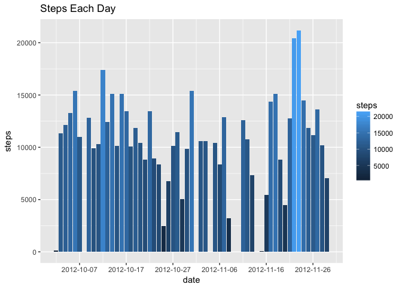
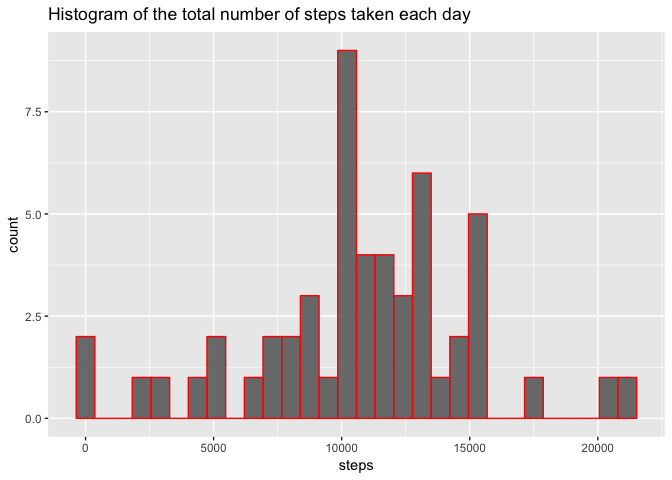
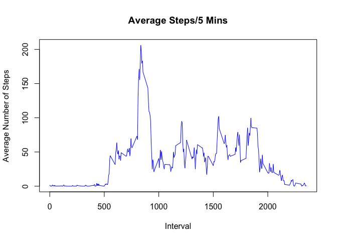

# Reproducible Research: Peer Assessment 1
## Introduction

This assignment makes use of data from a personal activity monitoring device. This device collects data at 5 minute intervals through out the day. The data consists of two months of data from an anonymous individual collected during the months of October and November, 2012 and include the number of steps taken in 5 minute intervals each day.

The data for this assignment can be downloaded from the course web site:

 - Dataset: [Activity monitoring data [52K]](https://d396qusza40orc.cloudfront.net/repdata%2Fdata%2Factivity.zip)
 
 The variables included in this dataset are:
 
  - **steps**: Number of steps taking in a 5-minute interval (missing values are coded as 𝙽𝙰)
  - **date**: The date on which the measurement was taken in YYYY-MM-DD format
  - **interval**: Identifier for the 5-minute interval in which measurement was taken
The dataset is stored in a comma-separated-value (CSV) file and there are a total of 17,568 observations in this dataset.

## Loading and preprocessing the data
###1.Load the data:

1 - Check if data exist, otherwise download it

```r
if (!file.exists("activity.csv") )
    {
     downloadUrl <- 'http://d396qusza40orc.cloudfront.net/repdata%2Fdata%2Factivity.zip'  
     download.file(downloadUrl,destfile='repdata%2Fdata%2Factivity.zip',mode='wb')  
     unzip('repdata%2Fdata%2Factivity.zip')
    }
```

2 - Reading the data from "activity.csv" and convert date to Date class


```r
#read data
data <- read.csv("activity.csv",header = T,sep = ",",na.strings = "NA")
data$date <- as.Date(data$date)

summary(data)
```

```
##      steps             date               interval     
##  Min.   :  0.00   Min.   :2012-10-01   Min.   :   0.0  
##  1st Qu.:  0.00   1st Qu.:2012-10-16   1st Qu.: 588.8  
##  Median :  0.00   Median :2012-10-31   Median :1177.5  
##  Mean   : 37.38   Mean   :2012-10-31   Mean   :1177.5  
##  3rd Qu.: 12.00   3rd Qu.:2012-11-15   3rd Qu.:1766.2  
##  Max.   :806.00   Max.   :2012-11-30   Max.   :2355.0  
##  NA's   :2304
```


## What is mean total number of steps taken per day?

1 - Calculate the total number of steps taken per day

```r
#agregate steps by day and calculate the total number
steps_per_day <- aggregate(steps~date,data = data, sum, na.rm = T)

#Plot steps taken each day
library(ggplot2)
ggplot(data = steps_per_day,aes(date,steps,fill = steps))+geom_bar(stat = 'identity')+ scale_x_date(date_breaks = "10 days") + ggtitle("Steps Each Day")
```

<!-- -->

2 - Make a histogram of the total number of steps taken each day

```r
#histogram of each day
ggplot(data = steps_per_day,aes(steps,fill = steps))+geom_histogram(data = steps_per_day,bins = 30,inherit.aes = T,col = "red",alpha = 0.8)+ ggtitle( "Histogram of the total number of steps taken each day")
```

<!-- -->
3 - Calculate and report the mean and median of the total number of steps taken per day


```r
steps_perday_mean <- mean(steps_per_day$steps)
steps_perday_median <- median(steps_per_day$steps)
```
mean


```r
steps_perday_mean
```

```
## [1] 10766.19
```
median

```r
steps_perday_median
```

```
## [1] 10765
```


## What is the average daily activity pattern?

1 - Calculating the average number of steps taken, averaged across all days:

```r
steps_interval <- aggregate(steps ~ interval, data = data, mean, na.rm = T)
plot(steps~interval,data = steps_interval,type="l",xlab = "Interval", ylab = "Average Number of Steps", 
     main = "Average Steps/5 Mins",col="blue")
```

<!-- -->

2 - The 5-minute interval that contains the maximum number of steps:

```r
maxStepInterval <- steps_interval[which.max(steps_interval$steps),"interval"]
#Which 5-minute interval, on average across all the days in the dataset, contains the maximum number of steps?
maxStepInterval
```

```
## [1] 835
```


## Imputing missing values
1 - Calculate and report the total number of missing values in the dataset (i.e. the total number of rows with 𝙽𝙰s)


```r
#number of rows which have missing values
number_NA <- sum(!complete.cases(data))
number_NA
```

```
## [1] 2304
```

2 - Devise a strategy for filling in all of the missing values in the dataset. Missing values are replaced by the mean of that 5-minute interval.


```r
#create filling functio
getIntervalMean <- function(data_row){
      steps_interval[steps_interval$interval == data_row$interval, "steps"]   
        
}
```

3 - Create a new dataset that is equal to the original dataset but with the missing data filled in.

```r
data_complete <- data
NA_index <- which(is.na(as.character(data_complete$steps)))

for (i in 1: nrow(data_complete)){
        if (is.na(data_complete[i,"steps"])){
                data_complete[i,"steps"] <- getIntervalMean(data_complete[i,]) 
        }
}
#summary of complete data
summary(data_complete)
```

```
##      steps             date               interval     
##  Min.   :  0.00   Min.   :2012-10-01   Min.   :   0.0  
##  1st Qu.:  0.00   1st Qu.:2012-10-16   1st Qu.: 588.8  
##  Median :  0.00   Median :2012-10-31   Median :1177.5  
##  Mean   : 37.38   Mean   :2012-10-31   Mean   :1177.5  
##  3rd Qu.: 27.00   3rd Qu.:2012-11-15   3rd Qu.:1766.2  
##  Max.   :806.00   Max.   :2012-11-30   Max.   :2355.0
```

4 - Make a histogram of the total number of steps taken each day and Calculate and report the mean and median total number of steps taken per day.

```r
complete_steps_per_day <- aggregate(steps~date,data = data_complete, sum)
ggplot(data = complete_steps_per_day,aes(steps,fill = steps))+geom_histogram(data = steps_per_day,bins = 30,inherit.aes = T,col = "red",alpha = 0.8)+ ggtitle( "Histogram of the total number of steps taken each day")
```

<!-- -->

```r
complete_steps_perday_mean <- mean(complete_steps_per_day$steps)
complete_steps_perday_median <- median(complete_steps_per_day$steps)
```

5 -  Calculating the mean and median total number of steps taken per day for the complete dataset:

```r
complete_steps_perday_mean <- mean(complete_steps_per_day$steps)
complete_steps_perday_median <- median(complete_steps_per_day$steps)

print(paste("complete data mean:", complete_steps_perday_mean, sep = ":"))
```

```
## [1] "complete data mean::10766.1886792453"
```

```r
print(paste("complete data median", complete_steps_perday_median, sep = ":"))
```

```
## [1] "complete data median:10766.1886792453"
```

```r
print(paste("data mean with NA:", steps_perday_mean, sep = ":"))
```

```
## [1] "data mean with NA::10766.1886792453"
```

```r
print(paste("data median with NA", steps_perday_median, sep = ":"))
```

```
## [1] "data median with NA:10765"
```


## Are there differences in activity patterns between weekdays and weekends?

1 - Create a new factor variable in the dataset with two levels – “weekday” and “weekend” indicating whether a given date is a weekday or weekend day:

```r
#create weekday/weekend factor
data_complete$we = as.factor(ifelse(weekdays(data_complete$date) %in% c("Saturday", "Sunday"),"weekend","weekday"))

weekday_data <- data_complete[data_complete$we == "weekday",]
weekend_data <- data_complete[data_complete$we == "weekend",]
```

2 - Make a panel plot containing a time series plot (i.e. 𝚝𝚢𝚙𝚎 = "𝚕") of the 5-minute interval (x-axis) and the average number of steps taken, averaged across all weekday days or weekend days (y-axis). See the README file in the GitHub repository to see an example of what this plot should look like using simulated data:

```r
complete_steps_interval = aggregate(steps~interval + we, data_complete,mean)
library(lattice)
xyplot(steps~interval | factor(we), data = complete_steps_interval, type = "l",layout= c(1,2), ylab = "Number of steps")
```

<!-- -->


